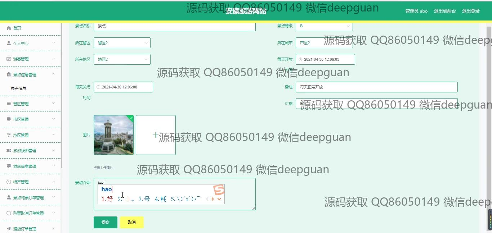
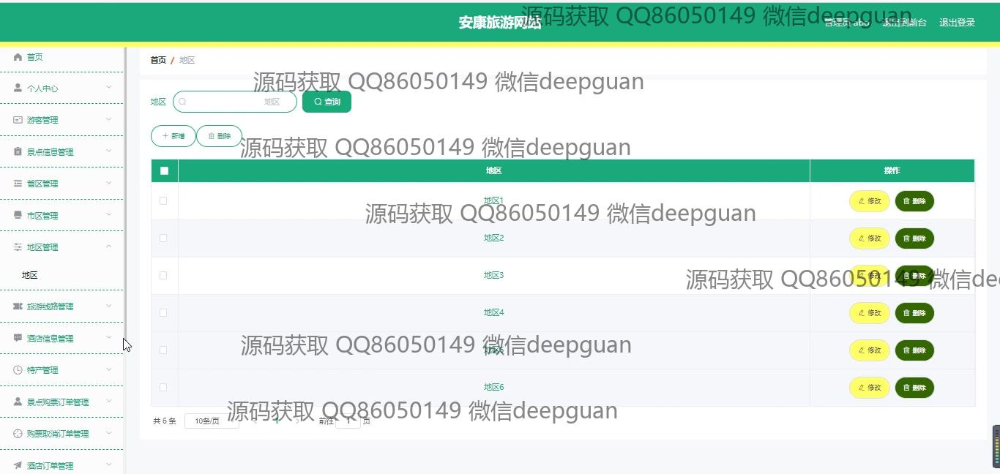
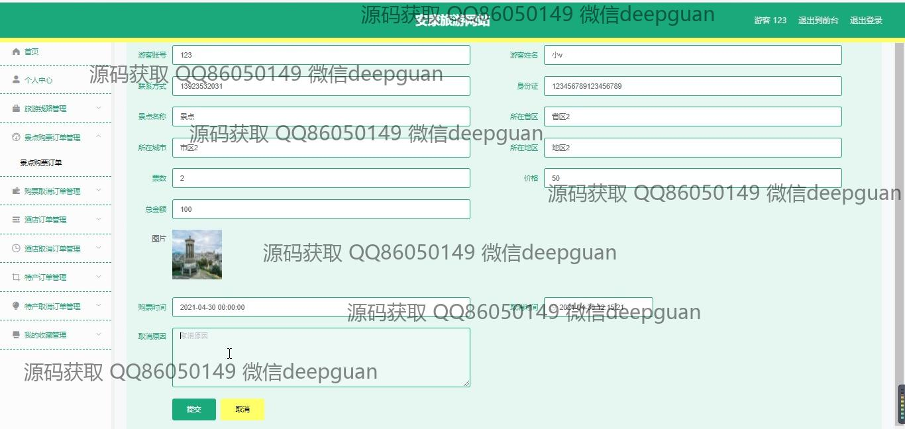
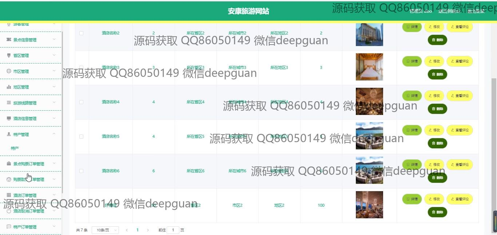

<h1 align="center">安康旅游网站的设计与实现</h1>

## 简介
安康旅游网站：角色分为管理员、游客；功能包括景点信息管理、旅游线路管理、酒店信息管理、特产展示、留言反馈、用户注册与登录、后台管理与审核功能。    --计算机毕业设计源码；毕设源码；java毕业设计源码

## 联系方式

<h3 align="center">获取完整代码与数据库文件 + 微信：deepguan QQ: 86050149 QQ群: 783742310</h3>

<h3 align="center">可帮忙远程部署 包运行成功！提供远程部署、修改代码、设计文档指导、代码讲解等服务！</h3>

## 功能介绍（完整见运行截图）
管理员：基本功能包括登录、注册和退出。网站首页提供主导航栏和景点推荐，还有旅游线路、酒店信息、特产展示。管理功能涵盖个人中心、游客管理、各类订单及景点、酒店和特产信息的增删改查。管理员可以编辑旅游新闻公告，管理后台提供全面的审核和内容管理工具，有助于整体旅游网站高效运行。

用户：可以进行登录、注册和退出操作。首页展示景点信息、推荐旅游线路、酒店信息、特产和新闻公告。用户能够查看景点推荐，查找并预订旅游线路与酒店，访问个人中心管理自己的信息和收藏。此外，用户可以留言反馈，参与景点的评论和互动，也支持个性化功能设置。

## 运行截图

本代码来源于网络,仅供学习参考使用!

